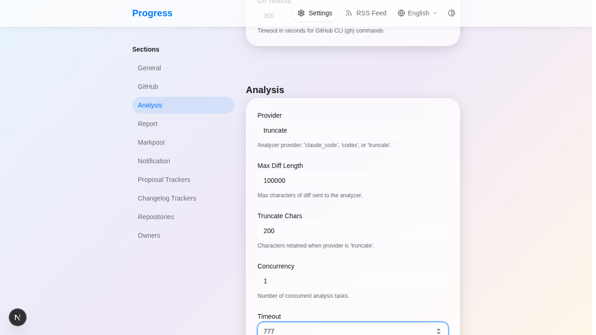
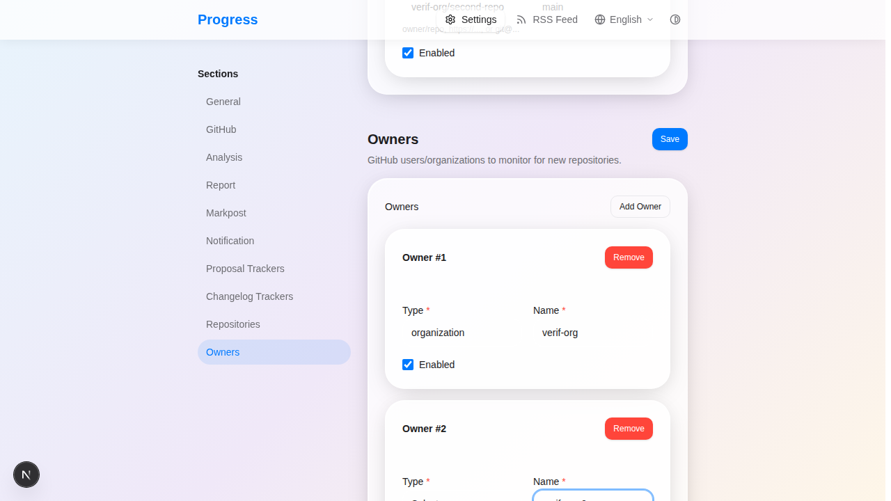
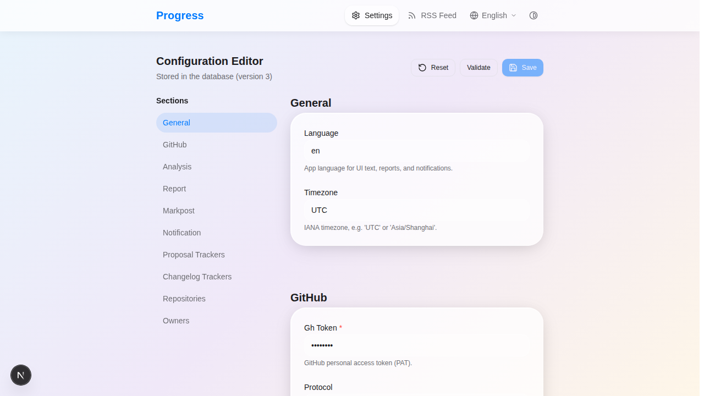
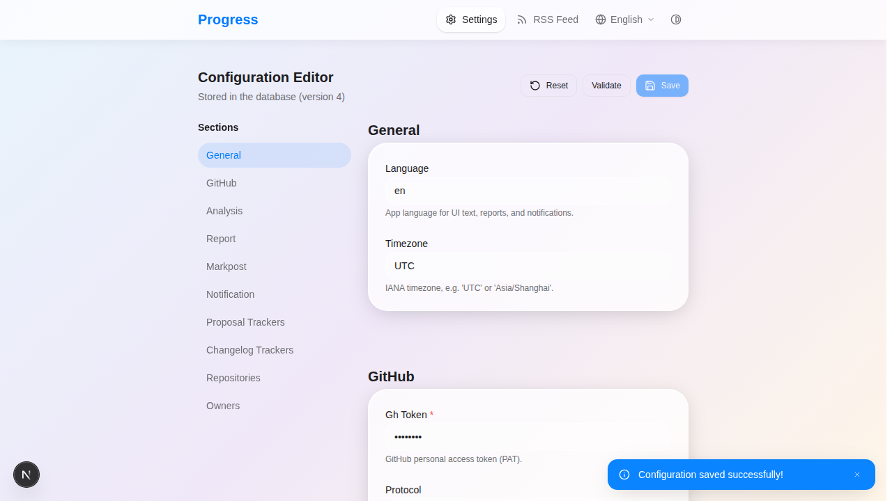

# Verification Report: Configuration Refactor (File → Database)

End-to-end verification of the config refactor documented in
[`config-refactor.md`](./config-refactor.md). The three claims under test:

1. **The config file provides initial values** (seeds the DB on first run).
2. **The web UI can change config** (and it persists to the DB).
3. **The file only provides initial values** — after seeding, the file is
   ignored; later changes go only through the web UI (or the explicit
   `progress config import`).

**Headline: 16 of 16 checks PASS. The owner-editing defect found in
Scenario 6 has been fixed (DB column unchanged; conversion at the model
layer); a regression test was added.**

## Result matrix

| # | Scenario | Claim | Result |
|---|---|---|---|
| 1 | File seeds DB on first run — CLI path, web never started | 1 | ✅ PASS |
| 2 | File seeds DB on first run — web `create_app` | 1 | ✅ PASS |
| 3 | Web edit scalar (`analysis.timeout`) persists to DB | 2 | ✅ PASS |
| 4 | Web edit does **not** write to the file | 2 / 3 | ✅ PASS |
| 5 | Web edit repos (add) persists to `repositories` table | 2 | ✅ PASS |
| 6 | Web edit owners (add) persists to `github_owners` table | 2 | ✅ PASS *(fixed after verification)* |
| 7 | Secret masking — GET returns `********` | security | ✅ PASS |
| 8 | Secret round-trip — re-saving without re-entering preserves the real value | security | ✅ PASS |
| 9 | Optimistic lock — stale version → HTTP 409 | concurrency | ✅ PASS |
| 10 | Validation — invalid POST → HTTP 400 | robustness | ✅ PASS |
| 11 | File ignored after seeding — CLI restart | 3 | ✅ PASS |
| 12 | File ignored after seeding — web backend restart | 3 | ✅ PASS |
| 13 | CLI `config import --force` (file → DB) | bridge | ✅ PASS |
| 14 | CLI `config export` (DB → file) | bridge | ✅ PASS |
| 15 | Web reflects DB after a CLI import (web reads DB, not file) | parity | ✅ PASS |
| 16 | `version` bumps on every write (1→2→3→4→5) | locking | ✅ PASS |

## Test environment

- **Isolation:** scratch database at `verification-data/progress.db`
  (`data_dir` pinned to an absolute path). The real `data/progress.db` was
  **never touched**.
- **Servers:** backend `fastapi dev` on `127.0.0.1:5000`
  (`PYTHONPATH=src CONFIG_FILE=verification-config.toml`); frontend `pnpm dev`
  on `:3000` (proxies `/api/*` → `:5000`).
- **Tools:** `playwright-cli` (bundled chromium, `--browser=chromium`) for the
  web UI; `sqlite3` (read-only) for the DB; `curl` for direct API probes; the
  CLI's own `_resolve_runtime_config()` to exercise the CLI code path
  network-free (the seed happens there, before any GitHub access).
- **Screenshots:** `docs/verification-assets/01–08*.png`.

### Seed file initial values (`verification-config.toml`)

Distinctive values were chosen so every DB assertion is unambiguous.

```toml
language  = "en"
timezone  = "UTC"
data_dir  = "<repo>/verification-data"     # infra; isolated scratch DB

[github]
gh_token  = "ghp_SEED_TOKEN_AAAA"          # secret under test
protocol  = "https"

[analysis]
provider  = "truncate"                      # no AI/network needed
timeout   = 555                             # scalar under test (non-default)
concurrency = 1
language  = "en"

[[repos]]
url       = "verif-org/seed-repo"
branch    = "main"

[[owners]]
type      = "organization"
name      = "verif-org"
```

## Scenario detail

### Scenario 1–2 — File seeds initial values (Claim 1) ✅

With the web server **not started**, the CLI's `_resolve_runtime_config()`
(the exact function `progress check`/`track-proposals` call) was run against a
fresh DB. It seeded the blob and the repos/owners tables from the file:

```
BLOB version: 1, schema_version: 2
analysis.timeout = 555, github.gh_token = ghp_SEED_TOKEN_AAAA   # from file
repos  = [('verif-org/seed-repo', '…/verif-org/seed-repo.git', 'main', True)]
owners = [('organization', 'verif-org', True)]
```

The blob correctly **excludes** `data_dir`/`workspace_dir`/`repos`/`owners`
(they live in infra / their own tables). Starting the web backend afterwards
ran `create_app()`, whose seed was a no-op (already seeded), and `GET
/api/v1/config` returned the same values with `version=1`.


### Scenario 3–4 — Web edit persists; file untouched (Claims 2 & 3) ✅

Via the web UI, `analysis.timeout` was changed `555 → 777` and saved.

| Source | `analysis.timeout` | `version` |
|---|---|---|
| File (`verification-config.toml`) | **555** (unchanged) | — |
| DB blob | **777** | 1 → **2** |




The web write went to the DB and bumped the version; the file was not modified.

### Scenario 5 — Web edit repos ✅

A second repo (`verif-org/second-repo`) was added through the Repositories
table and the section's Save (PUT `/api/v1/config/repos`). The seed repo was
**preserved with its `id=1`** (replace = upsert + prune, runtime state kept):

```
id=1 verif-org/seed-repo   (preserved)
id=2 verif-org/second-repo (added via web)
```



### Scenario 6 — Web edit owners ✅ PASS (defect found, then fixed)

Initially adding an owner via the web UI returned **HTTP 422** (even
re-saving the single existing owner failed).

**Root cause — field-name mismatch across layers:**

| Layer | Field name |
|---|---|
| TOML seed key | `type` |
| `OwnerConfig` pydantic model (`src/progress/config.py`) | `type` |
| DB column (`github_owners`) | `owner_type` |
| `OwnerView` GET response | `owner_type` |
| Frontend (`OWNERS_FIELD`, `OwnerInput`) | `owner_type` |

The frontend read `owner_type` from GET and PUT `owner_type`, but the body
validated against `OwnerConfig`, which required `type` → 422.

**Fix (DB column unchanged — conversion only at the model layer):** renamed
the `OwnerConfig` field to `owner_type` with `Field(alias="type")` and
`populate_by_name=True`. Now the model accepts **both** `owner_type` (the
frontend/API shape) and `type` (the TOML seed key, kept for backward
compatibility), and serializes to `owner_type` — matching the DB column and
the GET response. `replace_owners()` now reads `cfg.owner_type`. No DB
migration; the `github_owners.owner_type` column is untouched.

**Regression test added:** `test_owners_replace_accepts_owner_type_payload`
(`tests/api/test_config.py`) PUTs the `owner_type` payload the frontend
actually sends and asserts 200. The pre-existing `type`-shape test stays
green too, proving backward compatibility. Full suite: **465 passed**.

**Why CI originally missed it:** `tests/api/test_config.py` built owners with
`{"type": ...}` (the model's name), not the `owner_type` shape the client
sends, so the test passed without exercising the real payload.

### Scenario 7–8 — Secret masking & round-trip ✅

- `GET /api/v1/config` returns `github.gh_token = "********"` (masked), while
  the DB stores the real value.
- Rotated the token via the web password field (`ghp_SEED_TOKEN_AAAA` →
  `ghp_ROTATED_TOKEN_BBBB`): DB stored the real rotated token, GET still masked.
- Then changed `timeout` (`777 → 778`) and saved **without re-entering the
  token** (the field still shows `********`). The submitted mask was merged
  back to the stored real value:

```
version=4 | gh_token = ghp_ROTATED_TOKEN_BBBB (preserved) | timeout = 778
GET gh_token = ********   # still masked
```




### Scenario 9–10 — Optimistic lock & validation ✅

```
POST /api/v1/config  {"version": 1 (stale)}   →  HTTP 409
  "Config was modified by another writer (expected version 1, current 4)…"
POST /api/v1/config  {"analysis":{"provider":"not-a-real-provider"}} → HTTP 400
  "Configuration validation failed: github: Field required"
```

### Scenario 11–12 — File ignored after seeding (Claim 3) ✅

After all web edits, the file was changed to `timeout = 999` and
`gh_token = "ghp_FILE_EDIT_CCCC"`, then:

- **CLI restart:** a fresh process ran `_resolve_runtime_config()` (re-reads the
  file). The runtime config came from the **DB blob**, not the file:
  `timeout=778`, `gh_token=ghp_ROTATED_TOKEN_BBBB`, blob `version` unchanged
  (4). The file's 999 / `ghp_FILE_EDIT_CCCC` were ignored.
- **Web restart:** the backend was bounced (kill :5000, relaunch). `GET
  /api/v1/config` still returned `version=4`, `timeout=778`, masked token —
  i.e. the DB values, not the file's 999.

This is the key guarantee: editing the file does **not** affect running
config, and the CLI does not clobber web-made edits.

### Scenario 13–14 — Explicit file↔DB bridge ✅

`progress config import --force` (the only file→DB path after seeding):

```
Imported configuration into DB (version 5). Repos: Created: 0, Updated: 1, Deleted: 1.
DB: version=5 | analysis.timeout = 999 | gh_token = ghp_FILE_EDIT_CCCC   # now matches file
repos: verif-org/seed-repo   (second-repo pruned by replace)
```

`progress config export` (DB→file) dumped the blob with the real (unmasked)
values — `timeout = 999`, `gh_token = "ghp_FILE_EDIT_CCCC"` — appropriate for
an admin export.

### Scenario 15–16 — Parity & versioning ✅

After the CLI import changed the DB to `version=5 / timeout=999`, reloading the
web UI showed exactly those DB values — the web reads the DB, not the file.


`version` monotonically incremented on every successful write: **1 → 2 → 3 →
4 → 5** (three web saves, one CLI import).

## Conclusion

The refactor's core architecture is sound and behaves as designed: the file is
a one-time seed + infra provider; the DB blob (and repos/owners tables) are the
single source of truth; web edits persist under optimistic locking with secret
masking; the CLI and web share one config path so neither clobbers the other;
and `import`/`export` are the explicit file↔DB bridge. The file-ignored
guarantee (Claim 3) — the original motivation for the refactor — holds in full.

**Defect resolution:** the Scenario 6 owner-editing mismatch is fixed at the
model layer (alias), with the DB column unchanged, and a client-shape
regression test now guards it.

### Recommended follow-ups

1. ✅ **Fixed** — owner field mismatch resolved by aliasing `OwnerConfig`'s
   field to `owner_type` (DB column unchanged), plus a client-shape
   regression test.
2. ✅ **Done** — removed the superseded `RepositoryManager.sync` and
   `OwnerManager.sync_owners` (and the `sync_owners` tests) per
   `config-refactor.md` §7.
