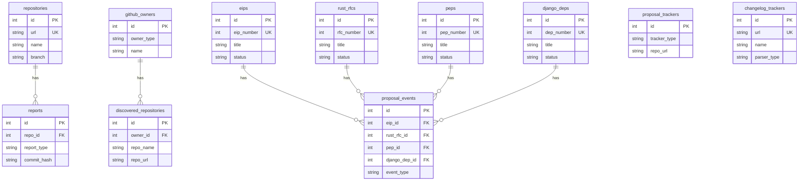

# Database Schema

This document describes the current database schema for Progress. The schema is defined through Peewee ORM models and managed via ad-hoc migrations in `db/__init__.py`. The project uses SQLite exclusively (with `PooledSqliteDatabase` from `playhouse.pool` for connection pooling).

## Entity Relationship Diagram

## Tables

### `repositories`

Defined in `src/progress/db/models.py`. Stores tracked Git repositories and their check state.

| Python Field | DB Column | Type | Nullable | Default | Constraints | Description |
|--------------|-----------|------|----------|---------|-------------|-------------|
| `id` | `id` | integer auto-increment | no | — | PK | Primary key |
| `name` | `name` | varchar | no | — | — | Repository display name |
| `url` | `url` | varchar | no | — | unique | Git clone URL |
| `branch` | `branch` | varchar | no | — | — | Branch to track |
| `last_commit_hash` | `last_commit_hash` | varchar | yes | — | — | Last seen commit SHA |
| `last_check_time` | `last_check_time` | datetime | yes | — | — | Timestamp of last check |
| `enabled` | `enabled` | boolean | no | `True` | — | Whether tracking is active |
| `created_at` | `created_at` | datetime | no | `now()` | — | Record creation time |
| `updated_at` | `updated_at` | datetime | no | `now()` | — | Record last update time (auto-updated on save) |
| `last_release_tag` | `last_release_tag` | varchar | yes | — | — | Last seen release tag |
| `last_release_commit_hash` | `last_release_commit_hash` | varchar | yes | — | — | Commit hash of last release |
| `last_release_check_time` | `last_release_check_time` | datetime | yes | — | — | Timestamp of last release check |

### `reports`

Defined in `src/progress/db/models.py`. Stores generated progress reports for repositories and other tracked items.

| Python Field | DB Column | Type | Nullable | Default | Constraints | Description |
|--------------|-----------|------|----------|---------|-------------|-------------|
| `id` | `id` | integer auto-increment | no | — | PK | Primary key |
| `report_type` | `report_type` | varchar | no | `"repo_update"` | — | Report type. Values: `"repo_update"`, `"repo_new"`, `"proposal"`, `"changelog"` |
| `repo` | `repo_id` | integer FK | yes | — | FK → `repositories`, ON DELETE CASCADE, index | Associated repository (nullable for non-repo reports) |
| `title` | `title` | varchar | no | `""` | — | Report title |
| `commit_hash` | `commit_hash` | varchar | no | — | — | Commit hash this report covers |
| `previous_commit_hash` | `previous_commit_hash` | varchar | yes | — | — | Previous commit hash for diff range |
| `commit_count` | `commit_count` | integer | no | `1` | — | Number of commits covered |
| `markpost_url` | `markpost_url` | varchar | yes | — | — | URL of published MarkPost article |
| `content` | `content` | text | yes | — | — | Report body (Markdown) |
| `created_at` | `created_at` | datetime | no | `now()` | — | Record creation time |

### `github_owners`

Defined in `src/progress/contrib/repo/models.py`. Stores GitHub organization/user owners for repository discovery.

| Python Field | DB Column | Type | Nullable | Default | Constraints | Description |
|--------------|-----------|------|----------|---------|-------------|-------------|
| `id` | `id` | integer auto-increment | no | — | PK | Primary key |
| `owner_type` | `owner_type` | varchar | no | — | unique together with `name` | Owner type (e.g., `"org"`, `"user"`) |
| `name` | `name` | varchar | no | — | unique together with `owner_type` | GitHub owner name |
| `enabled` | `enabled` | boolean | no | `True` | — | Whether discovery is active |
| `last_check_time` | `last_check_time` | datetime | yes | — | — | Timestamp of last repository scan |
| `last_tracked_repo` | `last_tracked_repo` | datetime | yes | — | — | Timestamp of most recent discovered repo |
| `created_at` | `created_at` | datetime | no | `now()` | — | Record creation time |
| `updated_at` | `updated_at` | datetime | no | `now()` | — | Record last update time (auto-updated on save) |

### `discovered_repositories`

Defined in `src/progress/contrib/repo/models.py`. Stores repositories discovered from tracked GitHub owners.

| Python Field | DB Column | Type | Nullable | Default | Constraints | Description |
|--------------|-----------|------|----------|---------|-------------|-------------|
| `id` | `id` | integer auto-increment | no | — | PK | Primary key |
| `owner` | `owner_id` | integer FK | no | — | FK → `github_owners`, ON DELETE CASCADE | Owning GitHub owner |
| `repo_name` | `repo_name` | varchar | no | — | unique together with `owner` | Repository name |
| `repo_url` | `repo_url` | varchar | no | — | — | Repository URL |
| `description` | `description` | text | yes | — | — | Repository description |
| `discovered_at` | `discovered_at` | datetime | no | `now()` | — | When the repo was first discovered |
| `updated_at` | `updated_at` | datetime | no | `now()` | — | Record last update time (auto-updated on save) |
| `has_readme` | `has_readme` | boolean | no | `False` | — | Whether README was fetched |
| `readme_summary` | `readme_summary` | text | yes | — | — | AI-generated README summary |
| `readme_detail` | `readme_detail` | text | yes | — | — | AI-generated README detail |
| `readme_was_truncated` | `readme_was_truncated` | boolean | no | `False` | — | Whether README was truncated before analysis |
| `notified` | `notified` | boolean | no | `False` | — | Whether a notification was sent |

### `proposal_trackers`

Defined in `src/progress/contrib/proposal/models.py`. Stores configuration for tracking proposal repositories (EIPs, PEPs, etc.).

| Python Field | DB Column | Type | Nullable | Default | Constraints | Description |
|--------------|-----------|------|----------|---------|-------------|-------------|
| `id` | `id` | integer auto-increment | no | — | PK | Primary key |
| `tracker_type` | `tracker_type` | varchar | no | — | unique together with `repo_url`, `branch`, `proposal_dir`, `file_pattern` | Proposal type (e.g., `"eip"`, `"pep"`, `"rust_rfc"`, `"django_dep"`) |
| `repo_url` | `repo_url` | varchar | no | — | unique together (see above) | Git repository URL |
| `branch` | `branch` | varchar | no | `"main"` | unique together (see above) | Branch to track |
| `enabled` | `enabled` | boolean | no | `True` | — | Whether tracking is active |
| `proposal_dir` | `proposal_dir` | varchar | no | `""` | unique together (see above) | Subdirectory containing proposals |
| `file_pattern` | `file_pattern` | varchar | no | `""` | unique together (see above) | Glob pattern for proposal files |
| `last_seen_commit` | `last_seen_commit` | varchar | yes | — | — | Last processed commit hash |
| `last_check_time` | `last_check_time` | datetime | yes | — | — | Timestamp of last check |
| `created_at` | `created_at` | datetime | no | `now()` | — | Record creation time |
| `updated_at` | `updated_at` | datetime | no | `now()` | — | Record last update time (auto-updated on save) |

### `eips`

Defined in `src/progress/contrib/proposal/models.py`. Stores Ethereum Improvement Proposals tracked from proposal repositories.

| Python Field | DB Column | Type | Nullable | Default | Constraints | Description |
|--------------|-----------|------|----------|---------|-------------|-------------|
| `id` | `id` | integer auto-increment | no | — | PK | Primary key |
| `eip_number` | `eip_number` | integer | no | — | unique | EIP number |
| `title` | `title` | varchar | no | — | — | Proposal title |
| `status` | `status` | varchar | no | — | — | Current status |
| `type` | `type` | varchar | yes | — | — | Proposal type (e.g., `"Standards Track"`, `"Meta"`) |
| `category` | `category` | varchar | yes | — | — | Proposal category |
| `author` | `author` | text | yes | — | — | Author(s) |
| `created_date` | `created_date` | datetime | yes | — | — | Proposal creation date |
| `file_path` | `file_path` | varchar | no | — | — | Path within the repository |
| `last_seen_commit` | `last_seen_commit` | varchar | yes | — | — | Last commit that touched this proposal |
| `last_check_time` | `last_check_time` | datetime | yes | — | — | Timestamp of last check |
| `analysis_summary` | `analysis_summary` | text | yes | — | — | AI-generated summary |
| `analysis_detail` | `analysis_detail` | text | yes | — | — | AI-generated detailed analysis |
| `created_at` | `created_at` | datetime | no | `now()` | — | Record creation time |
| `updated_at` | `updated_at` | datetime | no | `now()` | — | Record last update time (auto-updated on save) |

### `rust_rfcs`

Defined in `src/progress/contrib/proposal/models.py`. Stores Rust RFCs tracked from proposal repositories.

| Python Field | DB Column | Type | Nullable | Default | Constraints | Description |
|--------------|-----------|------|----------|---------|-------------|-------------|
| `id` | `id` | integer auto-increment | no | — | PK | Primary key |
| `rfc_number` | `rfc_number` | integer | no | — | unique | RFC number |
| `title` | `title` | varchar | no | — | — | Proposal title |
| `status` | `status` | varchar | no | — | — | Current status |
| `author` | `author` | text | yes | — | — | Author(s) |
| `created_date` | `created_date` | datetime | yes | — | — | Proposal creation date |
| `file_path` | `file_path` | varchar | no | — | — | Path within the repository |
| `last_seen_commit` | `last_seen_commit` | varchar | yes | — | — | Last commit that touched this proposal |
| `last_check_time` | `last_check_time` | datetime | yes | — | — | Timestamp of last check |
| `analysis_summary` | `analysis_summary` | text | yes | — | — | AI-generated summary |
| `analysis_detail` | `analysis_detail` | text | yes | — | — | AI-generated detailed analysis |
| `created_at` | `created_at` | datetime | no | `now()` | — | Record creation time |
| `updated_at` | `updated_at` | datetime | no | `now()` | — | Record last update time (auto-updated on save) |

### `peps`

Defined in `src/progress/contrib/proposal/models.py`. Stores Python Enhancement Proposals tracked from proposal repositories.

| Python Field | DB Column | Type | Nullable | Default | Constraints | Description |
|--------------|-----------|------|----------|---------|-------------|-------------|
| `id` | `id` | integer auto-increment | no | — | PK | Primary key |
| `pep_number` | `pep_number` | integer | no | — | unique | PEP number |
| `title` | `title` | varchar | no | — | — | Proposal title |
| `status` | `status` | varchar | no | — | — | Current status |
| `type` | `type` | varchar | yes | — | — | Proposal type (e.g., `"Standards Track"`, `"Informational"`) |
| `topic` | `topic` | varchar | yes | — | — | Proposal topic |
| `author` | `author` | text | yes | — | — | Author(s) |
| `created_date` | `created_date` | datetime | yes | — | — | Proposal creation date |
| `file_path` | `file_path` | varchar | no | — | — | Path within the repository |
| `last_seen_commit` | `last_seen_commit` | varchar | yes | — | — | Last commit that touched this proposal |
| `last_check_time` | `last_check_time` | datetime | yes | — | — | Timestamp of last check |
| `analysis_summary` | `analysis_summary` | text | yes | — | — | AI-generated summary |
| `analysis_detail` | `analysis_detail` | text | yes | — | — | AI-generated detailed analysis |
| `created_at` | `created_at` | datetime | no | `now()` | — | Record creation time |
| `updated_at` | `updated_at` | datetime | no | `now()` | — | Record last update time (auto-updated on save) |

### `django_deps`

Defined in `src/progress/contrib/proposal/models.py`. Stores Django Enhancement Proposals tracked from proposal repositories.

| Python Field | DB Column | Type | Nullable | Default | Constraints | Description |
|--------------|-----------|------|----------|---------|-------------|-------------|
| `id` | `id` | integer auto-increment | no | — | PK | Primary key |
| `dep_number` | `dep_number` | integer | no | — | unique | DEP number |
| `title` | `title` | varchar | no | — | — | Proposal title |
| `status` | `status` | varchar | no | — | — | Current status |
| `type` | `type` | varchar | yes | — | — | Proposal type |
| `created_date` | `created_date` | datetime | yes | — | — | Proposal creation date |
| `file_path` | `file_path` | varchar | no | — | — | Path within the repository |
| `last_seen_commit` | `last_seen_commit` | varchar | yes | — | — | Last commit that touched this proposal |
| `last_check_time` | `last_check_time` | datetime | yes | — | — | Timestamp of last check |
| `analysis_summary` | `analysis_summary` | text | yes | — | — | AI-generated summary |
| `analysis_detail` | `analysis_detail` | text | yes | — | — | AI-generated detailed analysis |
| `created_at` | `created_at` | datetime | no | `now()` | — | Record creation time |
| `updated_at` | `updated_at` | datetime | no | `now()` | — | Record last update time (auto-updated on save) |

### `proposal_events`

Defined in `src/progress/contrib/proposal/models.py`. Stores detected lifecycle events for proposals. This is a polymorphic event table — each row references exactly one proposal type via its nullable FK columns.

| Python Field | DB Column | Type | Nullable | Default | Constraints | Description |
|--------------|-----------|------|----------|---------|-------------|-------------|
| `id` | `id` | integer auto-increment | no | — | PK | Primary key |
| `eip` | `eip_id` | integer FK | yes | — | FK → `eips`, ON DELETE CASCADE | Associated EIP (mutually exclusive with other FKs) |
| `rust_rfc` | `rust_rfc_id` | integer FK | yes | — | FK → `rust_rfcs`, ON DELETE CASCADE | Associated Rust RFC (mutually exclusive with other FKs) |
| `pep` | `pep_id` | integer FK | yes | — | FK → `peps`, ON DELETE CASCADE | Associated PEP (mutually exclusive with other FKs) |
| `django_dep` | `django_dep_id` | integer FK | yes | — | FK → `django_deps`, ON DELETE CASCADE | Associated Django DEP (mutually exclusive with other FKs) |
| `event_type` | `event_type` | varchar | no | — | — | Event type. Values: `"created"`, `"status_changed"`, `"accepted"`, `"rejected"`, `"withdrawn"`, `"postponed"`, `"content_modified"`, `"resurrected"`, `"superseded"` |
| `old_status` | `old_status` | varchar | yes | — | — | Previous status (for status change events) |
| `new_status` | `new_status` | varchar | yes | — | — | New status (for status change events) |
| `commit_hash` | `commit_hash` | varchar | no | — | — | Commit hash where event was detected |
| `detected_at` | `detected_at` | datetime | no | `now()` | — | When the event was detected |
| `metadata` | `metadata` | json | no | `{}` | — | Additional event metadata |

### `changelog_trackers`

Defined in `src/progress/contrib/changelog/models.py`. Stores configuration for tracking changelog files in repositories.

| Python Field | DB Column | Type | Nullable | Default | Constraints | Description |
|--------------|-----------|------|----------|---------|-------------|-------------|
| `id` | `id` | integer auto-increment | no | — | PK | Primary key |
| `name` | `name` | varchar | no | — | — | Tracker display name |
| `url` | `url` | varchar | no | — | unique | Repository URL |
| `parser_type` | `parser_type` | varchar | no | — | — | Changelog parser type |
| `last_seen_version` | `last_seen_version` | varchar | yes | — | — | Last processed version |
| `enabled` | `enabled` | boolean | no | `True` | — | Whether tracking is active |
| `last_check_time` | `last_check_time` | datetime | yes | — | — | Timestamp of last check |
| `created_at` | `created_at` | datetime | no | `now()` | — | Record creation time |
| `updated_at` | `updated_at` | datetime | no | `now()` | — | Record last update time (auto-updated on save) |

## Design Conventions

### 1. Primary Keys

All tables use auto-increment integer primary keys (`IntegerField(primary_key=True)` in Peewee).

### 2. Timestamps

Business tables include `created_at` and `updated_at`. `created_at` defaults to `datetime.utcnow` on creation. `updated_at` is manually set to `datetime.utcnow` in overridden `save()` methods. The `reports` table only has `created_at` — it is effectively write-once for updates.

### 3. No Soft Delete

No tables use soft delete. Records are permanently removed via `DELETE` statements.

### 4. Foreign Keys and Cascading Deletes

Peewee `ForeignKeyField` definitions specify `on_delete="CASCADE"` to enforce referential integrity at the database level. Deleting a parent record (e.g., `Repository`, `GitHubOwner`, `EIP`) automatically removes all associated child records.

### 5. Single Database Engine

The project uses SQLite exclusively via Peewee's `PooledSqliteDatabase`. Connection pooling parameters (`max_connections`, `stale_timeout`, pragmas) are defined in `src/progress/consts.py`.

### 6. Schema Migration

There is no versioned migration system. Schema changes are applied via ad-hoc Python functions in `db/__init__.py:migrate_database()` that run on application startup. These use `PRAGMA table_info` to check for existing columns and `ALTER TABLE ADD COLUMN` or table rebuilds to apply changes.

### 7. Table Naming

Peewee's default naming convention is used: class names are converted to lowercase snake_case and pluralized (e.g., `Repository` → `repositories`, `ProposalEvent` → `proposal_events`).

### 8. Polymorphic Associations

The `proposal_events` table uses a polymorphic association pattern — four nullable FK columns (`eip_id`, `rust_rfc_id`, `pep_id`, `django_dep_id`) where exactly one is set per row. The `proposal` property on the model resolves which parent is referenced.
