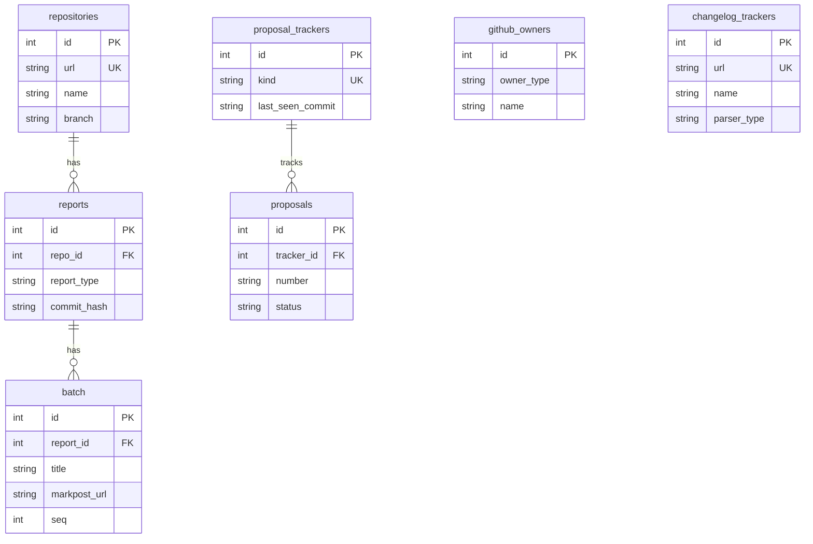

# Database Schema

This document describes the current database schema for Progress. The schema is defined through Peewee ORM models and managed via ad-hoc migrations in `db/__init__.py`. The project uses SQLite exclusively (with `PooledSqliteDatabase` from `playhouse.pool` for connection pooling).

## Entity Relationship Diagram

## Tables

### `repositories`

Defined in `src/progress/db/models.py`. Stores tracked Git repositories and their check state.

| Python Field | DB Column | Type | Nullable | Default | Constraints | Description |
|--------------|-----------|------|----------|---------|-------------|-------------|
| `id` | `id` | integer auto-increment | no | — | PK | Primary key |
| `name` | `name` | varchar | no | — | — | Repository display name |
| `url` | `url` | varchar | no | — | unique | Git clone URL |
| `branch` | `branch` | varchar | no | — | — | Branch to track |
| `last_commit_hash` | `last_commit_hash` | varchar | yes | — | — | Last seen commit SHA |
| `last_check_time` | `last_check_time` | datetime | yes | — | — | Timestamp of last check |
| `enabled` | `enabled` | boolean | no | `True` | — | Whether tracking is active |
| `created_at` | `created_at` | datetime | no | `now()` | — | Record creation time |
| `updated_at` | `updated_at` | datetime | no | `now()` | — | Record last update time (auto-updated on save) |
| `last_release_tag` | `last_release_tag` | varchar | yes | — | — | Last seen release tag |
| `last_release_commit_hash` | `last_release_commit_hash` | varchar | yes | — | — | Commit hash of last release |
| `last_release_check_time` | `last_release_check_time` | datetime | yes | — | — | Timestamp of last release check |

### `reports`

Defined in `src/progress/db/models.py`. Stores generated progress reports for repositories and other tracked items.

| Python Field | DB Column | Type | Nullable | Default | Constraints | Description |
|--------------|-----------|------|----------|---------|-------------|-------------|
| `id` | `id` | integer auto-increment | no | — | PK | Primary key |
| `report_type` | `report_type` | varchar | no | `"repo_update"` | — | Report type. Values: `"repo_update"`, `"repo_new"`, `"proposal"`, `"changelog"` |
| `repo` | `repo_id` | integer FK | yes | — | FK → `repositories`, ON DELETE CASCADE, index | Associated repository (nullable for non-repo reports) |
| `title` | `title` | varchar | no | `""` | — | Report title |
| `commit_hash` | `commit_hash` | varchar | no | — | — | Commit hash this report covers |
| `previous_commit_hash` | `previous_commit_hash` | varchar | yes | — | — | Previous commit hash for diff range |
| `commit_count` | `commit_count` | integer | no | `1` | — | Number of commits covered |
| `markpost_url` | `markpost_url` | varchar | yes | — | — | URL of published MarkPost article |
| `content` | `content` | text | yes | — | — | Report body (Markdown) |
| `created_at` | `created_at` | datetime | no | `now()` | — | Record creation time |

### `batch`

Defined in `src/progress/db/models.py` (model class `Batch`). Stores each MarkPost article published as part of a multi-batch aggregated report; one-to-many with `reports`. A row is created for every batch successfully uploaded during `process_reports` (see `src/progress/cli.py`). The parent is the aggregated report row (`repo_id = NULL`). The aggregated report's own `markpost_url` points to the first batch (`seq = 1`); only actually-uploaded batches are persisted (skipped oversized batches and markpost-disabled runs produce no rows).

| Python Field | DB Column | Type | Nullable | Default | Constraints | Description |
|--------------|-----------|------|----------|---------|-------------|-------------|
| `id` | `id` | integer auto-increment | no | — | PK | Primary key |
| `report` | `report_id` | integer FK | no | — | FK → `reports`, ON DELETE CASCADE; unique together with `seq` | Parent aggregated report |
| `title` | `title` | varchar | no | — | — | Title used for this batch's MarkPost article (includes the `(n/m)` suffix when there is more than one batch) |
| `markpost_url` | `markpost_url` | varchar | no | `""` | — | URL of the published MarkPost article for this batch |
| `seq` | `seq` | integer | no | — | unique together with `report_id`, `>= 1` | 1-based ordering within the parent report |
| `created_at` | `created_at` | datetime | no | `now()` | — | Record creation time |
| `updated_at` | `updated_at` | datetime | no | `now()` | — | Record last update time (auto-updated on save) |

### `github_owners`

Defined in `src/progress/contrib/repo/models.py`. Stores GitHub organization/user owners for repository discovery.

| Python Field | DB Column | Type | Nullable | Default | Constraints | Description |
|--------------|-----------|------|----------|---------|-------------|-------------|
| `id` | `id` | integer auto-increment | no | — | PK | Primary key |
| `owner_type` | `owner_type` | varchar | no | — | unique together with `name` | Owner type (e.g., `"org"`, `"user"`) |
| `name` | `name` | varchar | no | — | unique together with `owner_type` | GitHub owner name |
| `enabled` | `enabled` | boolean | no | `True` | — | Whether discovery is active |
| `last_check_time` | `last_check_time` | datetime | yes | — | — | Timestamp of last repository scan |
| `last_tracked_repo` | `last_tracked_repo` | datetime | yes | — | — | Timestamp of most recent discovered repo |
| `created_at` | `created_at` | datetime | no | `now()` | — | Record creation time |
| `updated_at` | `updated_at` | datetime | no | `now()` | — | Record last update time (auto-updated on save) |

### `proposal_trackers`

Defined in `src/progress/contrib/proposal/models.py` (model class `ProposalTrackerState`). Stores the per-kind runtime cursor for proposal tracking. The static per-kind configuration — repository URL, branch, proposal directory, and file glob patterns — is defined in code via `KIND_CONFIGS` in `src/progress/contrib/proposal/types.py` and is no longer persisted; the database holds only the incremental-check state. One row exists per proposal `kind`.

| Python Field | DB Column | Type | Nullable | Default | Constraints | Description |
|--------------|-----------|------|----------|---------|-------------|-------------|
| `id` | `id` | integer auto-increment | no | — | PK | Primary key |
| `kind` | `kind` | varchar | no | — | unique | Proposal kind. Values: `"eip"`, `"erc"`, `"pep"`, `"rfc"`, `"dep"` |
| `last_seen_commit` | `last_seen_commit` | varchar | yes | — | — | Last processed commit hash in the kind's repository |
| `last_check_time` | `last_check_time` | datetime | yes | — | — | Timestamp of last check |
| `created_at` | `created_at` | datetime | no | `now()` | — | Record creation time |
| `updated_at` | `updated_at` | datetime | no | `now()` | — | Record last update time (auto-updated on save) |

### `proposals`

Defined in `src/progress/contrib/proposal/models.py` (model class `Proposal`). Unified table storing individual proposals across all kinds. It replaces the former per-kind tables (`eips`, `rust_rfcs`, `peps`, `django_deps`); a proposal's kind is determined by its parent tracker's `kind`. Proposal lifecycle changes (new, status change, content modification, deletion, move) are detected at check time and emitted as reports (rows in `reports` with `report_type = "proposal"`) rather than persisted in a dedicated events table.

| Python Field | DB Column | Type | Nullable | Default | Constraints | Description |
|--------------|-----------|------|----------|---------|-------------|-------------|
| `id` | `id` | integer auto-increment | no | — | PK | Primary key |
| `tracker` | `tracker_id` | integer FK | no | — | FK → `proposal_trackers`, ON DELETE CASCADE; unique together with `number` | Parent tracker (determines the proposal kind) |
| `number` | `number` | varchar | no | — | unique together with `tracker` | Proposal number (e.g., EIP `1`, PEP `8`); stored as text to accommodate non-numeric schemes |
| `title` | `title` | varchar | yes | — | — | Proposal title |
| `raw_status` | `raw_status` | varchar | no | `""` | — | Status string as parsed from the proposal file |
| `status` | `status` | varchar | no | — | — | Normalized status (see `ProposalStatus`). Values: `"draft"`, `"review"`, `"accepted"`, `"final"`, `"active"`, `"stagnant"`, `"deferred"`, `"withdrawn"`, `"rejected"`, `"superseded"`, `"moved"`, `"unknown"` |
| `created_at` | `created_at` | datetime | no | `now()` | — | Record creation time |
| `updated_at` | `updated_at` | datetime | no | `now()` | — | Record last update time (auto-updated on save) |

### `changelog_trackers`

Defined in `src/progress/contrib/changelog/models.py`. Stores configuration for tracking changelog files in repositories.

| Python Field | DB Column | Type | Nullable | Default | Constraints | Description |
|--------------|-----------|------|----------|---------|-------------|-------------|
| `id` | `id` | integer auto-increment | no | — | PK | Primary key |
| `name` | `name` | varchar | no | — | — | Tracker display name |
| `url` | `url` | varchar | no | — | unique | Repository URL |
| `parser_type` | `parser_type` | varchar | no | — | — | Changelog parser type |
| `last_seen_version` | `last_seen_version` | varchar | yes | — | — | Last processed version |
| `enabled` | `enabled` | boolean | no | `True` | — | Whether tracking is active |
| `last_check_time` | `last_check_time` | datetime | yes | — | — | Timestamp of last check |
| `created_at` | `created_at` | datetime | no | `now()` | — | Record creation time |
| `updated_at` | `updated_at` | datetime | no | `now()` | — | Record last update time (auto-updated on save) |

## Design Conventions

### 1. Primary Keys

All tables use auto-increment integer primary keys (`IntegerField(primary_key=True)` in Peewee, or Peewee's implicit auto-increment `id` for models that inherit directly from `peewee.Model`).

### 2. Timestamps

Business tables include `created_at` and `updated_at`. `created_at` defaults to `datetime.utcnow` on creation. `updated_at` is manually set to `datetime.utcnow` in overridden `save()` methods. The `reports` table only has `created_at` — it is effectively write-once for updates.

### 3. No Soft Delete

No tables use soft delete. Records are permanently removed via `DELETE` statements.

### 4. Foreign Keys and Cascading Deletes

Peewee `ForeignKeyField` definitions specify `on_delete="CASCADE"` to enforce referential integrity at the database level. Deleting a parent record (e.g., `Repository`, `GitHubOwner`, `ProposalTrackerState`) automatically removes all associated child records.

### 5. Single Database Engine

The project uses SQLite exclusively via Peewee's `PooledSqliteDatabase`. Connection pooling parameters (`max_connections`, `stale_timeout`, pragmas) are defined in `src/progress/consts.py`.

### 6. Schema Migration

There is no versioned migration system. Schema changes are applied via ad-hoc Python functions in `db/__init__.py:migrate_database()` that run on application startup. These use `PRAGMA table_info` to check for existing columns and `ALTER TABLE ADD COLUMN` or table rebuilds to apply changes. Legacy proposal tables (`proposal_events`, `eips`, `rust_rfcs`, `peps`, `django_deps`) and the previous `proposal_trackers` schema (identified by its `tracker_type` column) are dropped during migration so the new `proposal_trackers` / `proposals` tables can be (re)created cleanly.

### 7. Table Naming

Table names are declared explicitly via `Meta.table_name` and generally follow lowercase snake_case, pluralized for collections (e.g., `Repository` → `repositories`, `Proposal` → `proposals`, `ProposalTrackerState` → `proposal_trackers`).

### 8. Unified Proposal Schema

Proposals are stored in a single `proposals` table keyed by `(tracker_id, number)`, where the parent tracker's `kind` distinguishes EIPs, ERCs, PEPs, RFCs, and DEPs. Static per-kind configuration lives in code (`KIND_CONFIGS`), not the database, which holds only the incremental-check cursor per kind. Proposal lifecycle events are not persisted in a dedicated table — each detected change (new, status transition, content modification, deletion, move) is written as a `reports` row with `report_type = "proposal"`.
